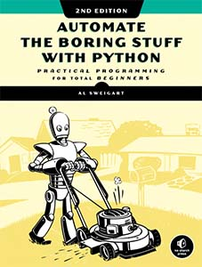

# *Invent with Python* Source Code

This repository accompanies [*Automate the Boring Stuff with Python, 2nd Edition*](https://nostarch.com/automatestuff2) by [*Al Sweigart*](https://alsweigart.com) (No Starch Press, 2019).

[Read Online for Free](https://automatetheboringstuff.com)

Download the files as a zip using the green button, or clone the repository to your machine using Git.

## Support

If you find this project helpful and would like to support its development, [consider donating to its author on Patreon](https://www.patreon.com/AlSweigart).

Read the author's other free programming books on [InventWithPython.com](https://inventwithpython.com). Support the author with a purchase: [Buy Direct from Publisher (Free Ebook!)](https://www.nostarch.com/automatestuff2) | [Buy on Amazon](https://inventwithpython.com/amazon-automate2)
